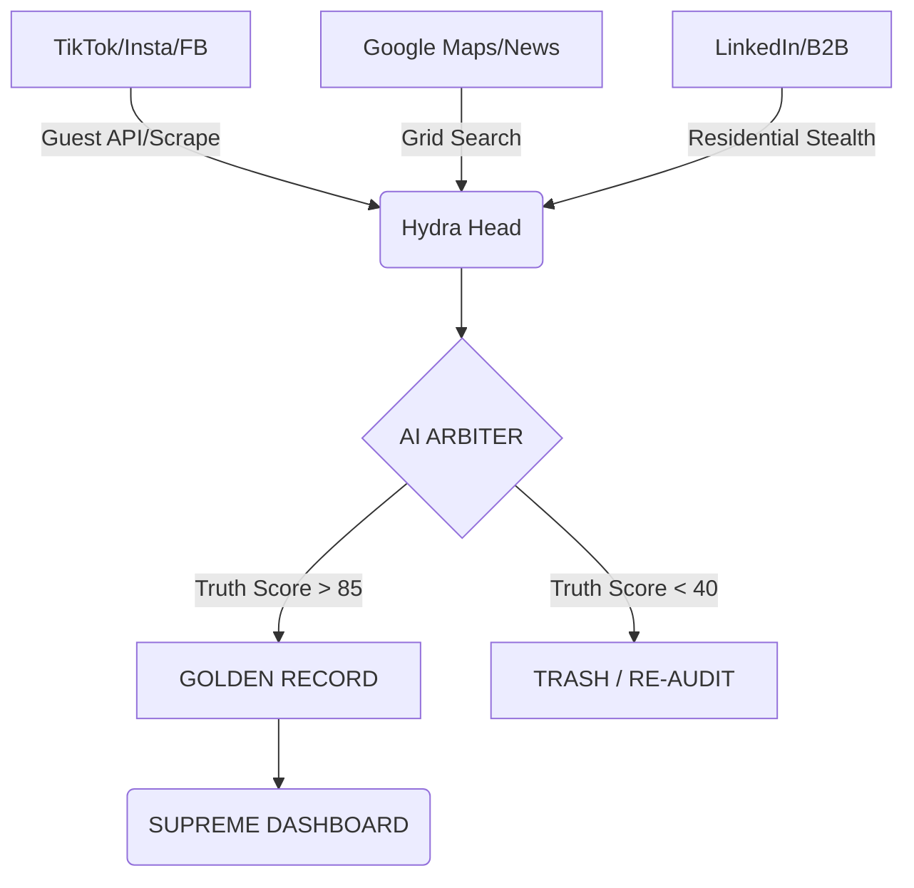

# 📡 DEEPER RESEARCH: THE GLOBAL SENSORY HUB
**Classification:** SENSORY-DOMINANCE | PROJECT NEXUS
**Focus:** Building a 360-degree Intelligence Network.

---

> [!TIP]
> **Always-On Intelligence:** Your laptop is no longer just a computer; it is a **"Hydra Sentry."** By leaving it on with the `run_loop` active, it will continuously "harvest" data while you sleep, populating the Vault for sale the next morning.

## 1. The New Sensory Nodes (2026 Stack)
We are expanding beyond LinkedIn to ingest the entire internet's heartbeat.

### Node: TikTok (The Commercial Pulse)
*   **Extraction:** We will use **Mobile App Emulation** (mimicking TikTok's internal GraphQL) to find products that are "going viral" before they hit Amazon.
*   **Winning Edge:** Our AI Arbiter will distinguish between "Fake Bot Engagement" and "Real Human Buying Intent" using multi-platform cross-checking.

### Node: Google Maps & News (The Local & Global Pulse)
*   **Maps:** Automated "Grid Search" to bypass the 120-result limit. We slice a city into 100 small squares and scrape them individually—extracting 1,000+ businesses per city.
*   **News:** Real-time sentiment analysis of Google News RSS feeds to detect mergers, layoffs, or funding rounds **minutes before** they appear on LinkedIn.

### Node: Facebook (The Legacy Core)
*   **Strategy:** Using the `mbasic` gateway to extract "Shadow Signals" from community groups and public business pages without the heavy JS footprint that triggers detection.

---

## 2. The "Automated Sentry" Workflow
To ensure you don't need to be at your laptop, we will implement:

1.  **Hydra Bootloader:** A script that automatically starts the local worker when your laptop wakes up.
2.  **Heartbeat Monitoring:** The Render API will watch your local worker. If it goes offline, the Dashboard will notify your phone via a "Nexus-Alert."
3.  **Low-Power Stealth:** The worker will run in "Stealth-Background" mode, using minimal CPU so you can still use your laptop while it scrapes in the background.

---

## 3. The "Unstoppable" Data Pipeline

---

**STATUS:** SENSORY EXPANSION DEFINED
**NEXT ACTION:** Update `worker/scrapers/` to include the initial TikTok Guest Engine.
